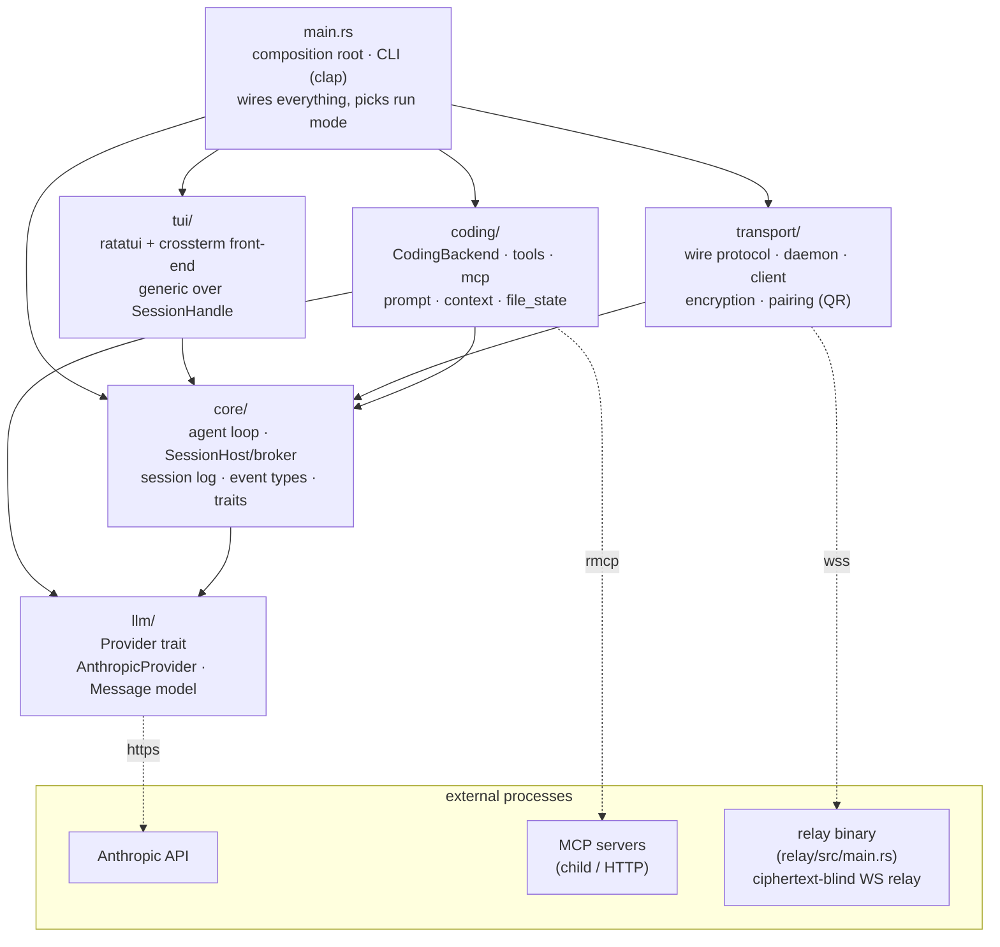
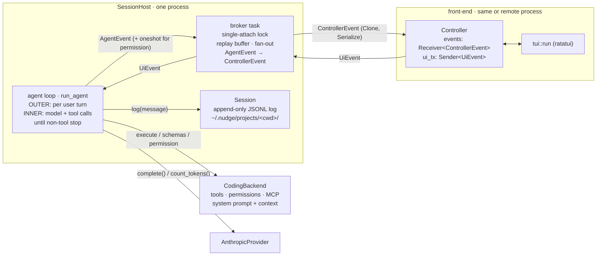
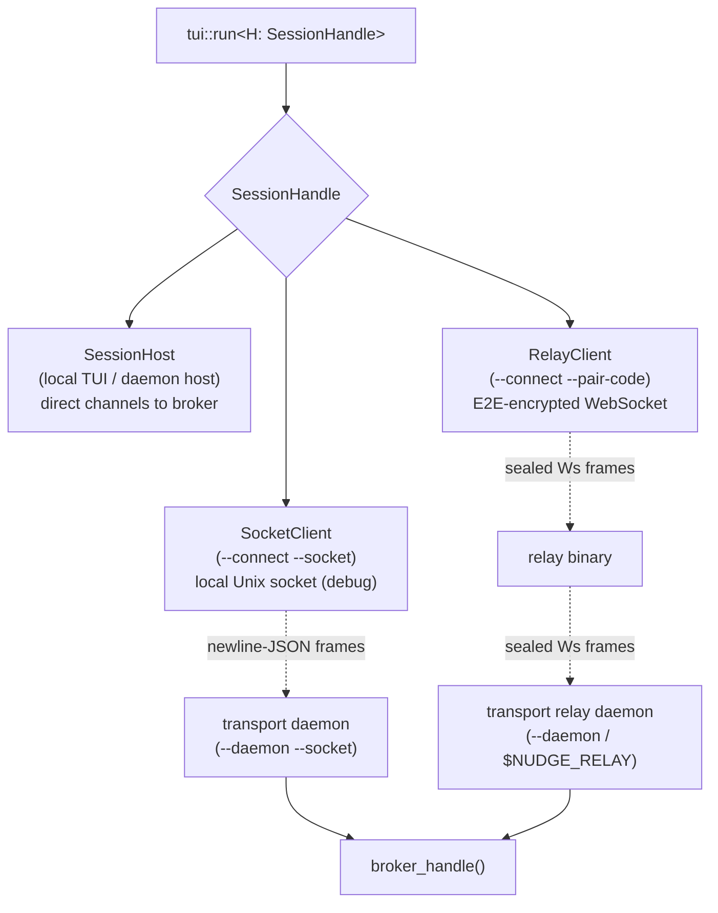

# Architecture

`nudge` is a from-scratch coding agent in Rust — the loop, the tool-use protocol,
and the wire protocol all hand-rolled, no agent SDK underneath. It's organized as strict
dependency layers: every arrow points **down**, and no lower layer ever names a
higher one. The agent loop (`core`) is UI- and tool-agnostic; the concrete
coding behavior (`coding`) and the wire protocol (`transport`) are both built on
top of it, and the front-end (`tui`) is generic over how it reaches a session.

## Layered module dependencies

## Runtime: the session host, broker, and front-ends

A `SessionHost` owns two long-lived tokio tasks - the **agent loop**
(`run_agent`) and a **broker** - plus the channels between them. The loop's
channels terminate at the broker, not at any front-end, so a front-end attaching
and detaching never ends the session. The loop ends only on an explicit `Quit`.

### Event vocabulary (`core/events.rs`)

- **`UiEvent`** - front-end → loop: `UserMessage`, `SetModel`, `LoadServer` /
  `UnloadServer` / `ListServers`, `PermissionResponse`, `Quit`.
- **`AgentEvent`** - loop → broker: assistant text/thinking, tool start/result,
  usage, `PermissionRequest` (carries a `oneshot` reply slot), `Notice`,
  `Error`. Deliberately **not** serializable.
- **`ControllerEvent`** - broker → front-end: a `Clone + Serialize` mirror of
  `AgentEvent` with the `oneshot` terminated and `UserMessage` echoes +
  `PermissionResolved` markers injected, so any controller (live or
  attach-replay) reconstructs the whole transcript from this one stream.

## How a front-end reaches the session: `SessionHandle`

`tui::run` is generic over the `SessionHandle` trait, so the front-end code is
byte-for-byte identical whether it drives the loop in-process or across a wire.

The `SessionHandle` trait exposes three operations:

- **`attach`** — bind a front-end; returns `None` if the broker's single-attach
  lock is held elsewhere.
- **`attach_force`** — same but overrides the lock (local TUI force-takeover,
  so the physically-present machine can reclaim a session a phone left attached).
  Only `SessionHost` overrides the default; remote `--connect` clients never force.
- **`detach`** — release the front-end without ending the session (`/background`);
  the loop keeps running headless and buffers events for the next `attach`.

The `transport` layer puts the broker's in-memory `Controller` stream onto a
wire. `wire` defines the framed protocol over a transport-agnostic seam
(`FrameReader`/`FrameWriter`) with two codecs: newline-JSON for the local Unix
socket and a `Ws` codec for the relayed WebSocket. `encryption` (dryoc) seals
frames for the relay path - the relay box only ever sees ciphertext; `pairing`
mints/encodes the QR that carries the relay URL, room id, and E2E key to a
device.

## The `/background` handoff hook

`SessionHost::set_handoff_hook` registers a closure that fires on every
`/background`, lazily. The hook is wired in `main.rs` (not `core`) to keep `core`
below the transport layer. It is installed only when `$NUDGE_RELAY` is set: a
`Pairing` (room id + E2E key) is generated at startup, and on `/background` the
hook dials OUT to the relay so a phone can attach, reporting its progress
(`connecting` → `connected` → `failed`) back to the TUI's pair screen. The QR and
pairing code are surfaced once connected. The hook dedupes its own re-dialing, so
firing each time just lets a failed dial be retried by backgrounding again. With
no relay configured, `/background` still pauses the session — it just shows no QR.
Local Unix-socket handoff is no longer co-located with a session; the socket
transport survives only as the standalone `--daemon --socket` / `--connect --socket`
debug path.

## Run modes (selected in `main.rs`)

| Invocation                                   | Topology                                                                                          |
| -------------------------------------------- | ------------------------------------------------------------------------------------------------- |
| `nudge`                                      | In-process `SessionHost` + local TUI. `/background` dials `$NUDGE_RELAY` and shows a QR (if set). |
| `nudge --daemon`                             | Headless host that dials **out** to `$NUDGE_RELAY`; mints a room + key and prints a QR.           |
| `nudge --connect --pair-code <code>`         | Front-end only (`RelayClient`) over the relay; the code carries relay + room + key.               |
| `nudge --daemon --socket <path>`             | Headless host bound to a local Unix socket (debugging the transport without a relay).             |
| `nudge --connect --socket <path>`            | Front-end only (`SocketClient`) over a local Unix socket (debug).                                 |
| `nudge --print-prompt`                       | Standalone one-shot action, then exit.                                                            |

## The coding agent (`coding/`)

`CodingBackend` implements `core::Backend` — the only thing the loop knows about
tools. It owns:

- **`tools/`** - `Bash`, `Read`, `Edit`, `CreateNew`, `Grep`, `Glob`,
  `TodoWrite`, dispatched by name. Read-only tools (`Read`/`Grep`/`Glob`/
  `TodoWrite`) auto-allow; the rest gate on a per-call permission prompt.
- **`mcp/`** - connects MCP servers from project-local `.mcp.json`, plus a
  catalog of dormant servers loadable at runtime via `/mcp load`.
- **`prompt` / `context`** - assembles the system prompt with fresh env, git,
  and directory context each turn.
- **`file_state`** - tracks read files to enforce the read-before-edit
  invariant.

## Module map

Three long-lived tokio tasks connected by mpsc channels: the **agent task** runs the loop
and emits typed events (`AssistantText`, `ToolUseStart`, `ToolResult`, `PermissionRequest`,
…); a **broker task** sits between the loop and the front-ends — it buffers the event
stream, fans it out to **every attached client** (your terminal, your phone, a peer agent —
each announces an identity at attach, and the shared transcript shows who said what), and
keeps the loop alive while clients come and go; the **front-end task** (the TUI) renders
events and sends user messages back. Because the loop talks only to the broker, the session
outlives any one front-end — you can detach and reattach, locally or from another process
over a socket — and the agent never touches stdin/stdout directly, so the UI is swappable.
The same connection works in reverse: the loop can itself attach to *other agents'* brokers,
which is all a subagent is.

The code is layered into five modules with a downward dependency direction — `coding → core
→ llm`, plus `transport → core` and `tui` on top — so each layer can be understood (and
swapped) on its own:

| Module | Role |
|---|---|
| `src/main.rs`, `src/cli.rs`, `src/run/`, `src/spawn.rs` | the composition root: CLI parsing, session create/resume, run-mode wiring (in-process / daemon / connect), and the subagent factory |
| `src/llm/` | provider-agnostic LLM API: a neutral message model + `Provider` trait, with `AnthropicProvider` owning all Anthropic wire shaping (cache-breakpoint placement, the floating breakpoint, the HTTP calls) |
| `src/core/` | the generic harness: the loop (build request → call provider → dispatch tools → repeat) + a `Backend` trait, the agent↔UI event contract, the multi-client broker that decouples the loop from front-ends, the peer system (holding/steering/messaging other agents), and the session mechanism (JSONL persistence, resume with strict truncation) — knows nothing about concrete tools or prompts |
| `src/coding/` | the coding agent: implements `Backend` — system prompt, project/env context, the tool registry + dispatch + permission classification, the MCP client, file-state tracking, and the cwd-keyed session path policy |
| `src/transport/` | lets a front-end drive a session from another process: a small framed wire protocol over a local socket, with daemon (host) and client ends behind a `SessionHandle` the TUI is generic over — so the same TUI code runs in-process or attached to a remote host |
| `src/tui/` | ratatui app: semantic log entries, collapsed/expanded rendering, permission modal, session replay |

The `core` loop is generic over both the `Provider` and the `Backend`, so a different model
backend or a non-coding agent could reuse it untouched.

## Selected design decisions

- **Permission prompts await a typed reply.** The `PermissionRequest` event embeds a
  `oneshot::Sender<bool>`; the agent literally `.await`s your decision. A denial cancels the
  rest of the tool batch and pauses for your next instruction, which rides back in the same
  turn — denial means "I want something different", not "retry".
- **`Edit`/`CreateNew` instead of a `Write` tool.** Tools partition by file-state
  precondition: `Edit` requires an existing file, `CreateNew` requires a non-existing path.
  There is deliberately no create-or-overwrite primitive — wholesale-overwriting a file the
  model hasn't read would let it silently destroy content.
- **Crash-safe conversation state.** On API failure mid-turn, the in-memory message vec
  rolls back to the last completed turn so the conversation always stays on a valid
  alternating-role boundary. The JSONL log is independent and append-only — it's the audit
  trail, not the API payload.
- **Floating cache breakpoint.** Model output never changes once emitted, so each request
  moves a `cache_control` marker to the latest assistant message; the entire stable history
  is then a cache read (~0.1× input price) and only the newest messages pay full price.
- **TUI stores meaning, not pixels.** The log holds semantic entries (`ToolCall { id, name,
  summary, result }`), re-rendered per frame — that's what makes expand/collapse instant and
  lets session replay render identically to live. All foreign text (tool output, summaries,
  model text) is sanitized before it reaches a terminal cell, because cell-grid renderers
  don't interpret control characters.
- **A broker decouples the loop from the front-end.** The loop's event/command channels
  terminate at a long-lived broker rather than the UI, so attaching or detaching a front-end
  never ends the session — only an explicit quit does. The broker buffers the event stream
  (a reattaching front-end replays the whole transcript) and fans it out to every attached
  client; each attach announces an identity, so a shared session attributes every message to
  its sender. The TUI also renders user turns and allow/deny lines *from that stream*, not
  optimistically on the keypress, so one code path serves both live input and replay — and
  `/background` plus the `--daemon`/`--connect` split fall out of it without the loop knowing
  which front-end, if any, is watching.
- **A subagent is just another client.** There is no bespoke sub-agent runtime: spawning a
  child means standing up a second session and mutually attaching — the parent attaches to
  the child the same way your phone attaches to the parent, and the child attaches back.
  Roles (who supervises whom, who may dismiss whom) follow from who spawned whom, not from a
  type in the code, so the same mechanism extends unchanged to peers on other machines.
  Supervision is context-frugal by design: the parent decides a child's permission check-ins
  with one inference over its own (cached) transcript, and records only a one-line verdict —
  a subagent's whole value is that you buy its conclusion without buying its context.