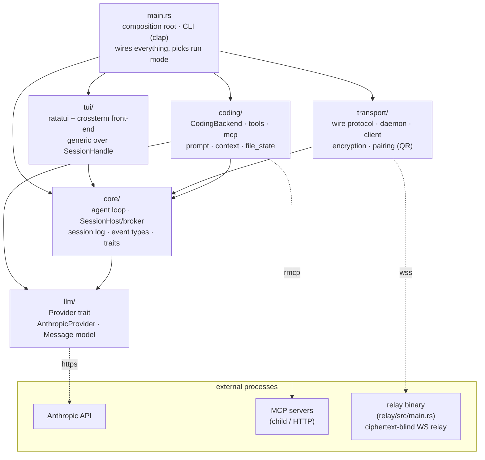
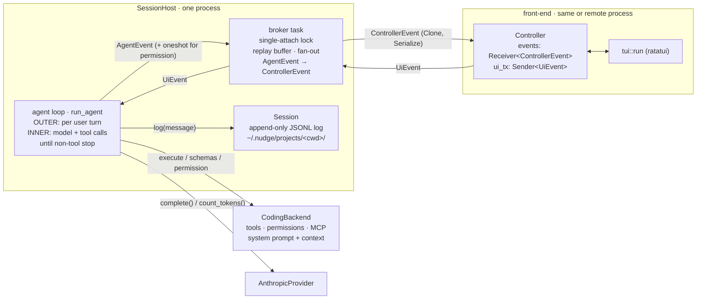
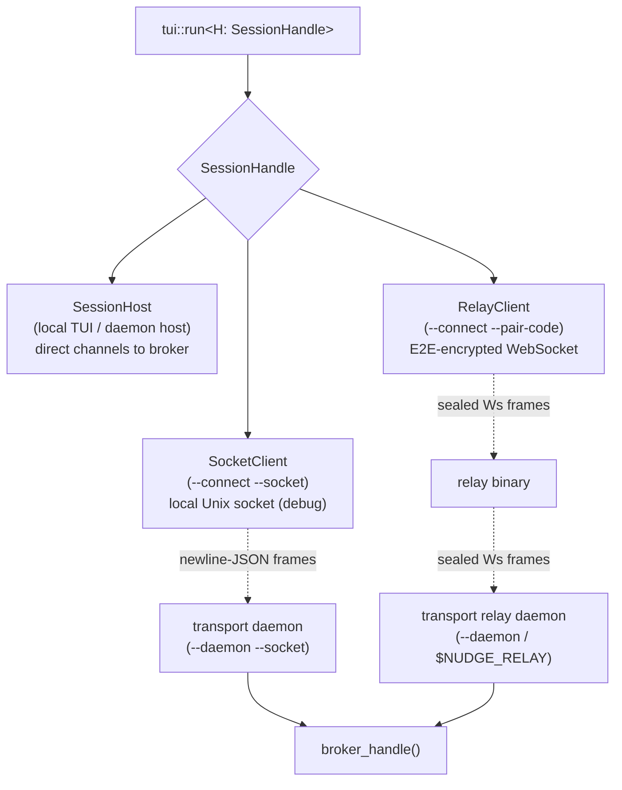

# Architecture

`nudge` is a Claude-Code-style coding agent. It's organized as strict
dependency layers: every arrow points **down**, and no lower layer ever names a
higher one. The agent loop (`core`) is UI- and tool-agnostic; the concrete
coding behavior (`coding`) and the wire protocol (`transport`) are both built on
top of it, and the front-end (`tui`) is generic over how it reaches a session.

## Layered module dependencies

## Runtime: the session host, broker, and front-ends

A `SessionHost` owns two long-lived tokio tasks - the **agent loop**
(`run_agent`) and a **broker** - plus the channels between them. The loop's
channels terminate at the broker, not at any front-end, so a front-end attaching
and detaching never ends the session. The loop ends only on an explicit `Quit`.

### Event vocabulary (`core/events.rs`)

- **`UiEvent`** - front-end → loop: `UserMessage`, `SetModel`, `LoadServer` /
  `UnloadServer` / `ListServers`, `PermissionResponse`, `Quit`.
- **`AgentEvent`** - loop → broker: assistant text/thinking, tool start/result,
  usage, `PermissionRequest` (carries a `oneshot` reply slot), `Notice`,
  `Error`. Deliberately **not** serializable.
- **`ControllerEvent`** - broker → front-end: a `Clone + Serialize` mirror of
  `AgentEvent` with the `oneshot` terminated and `UserMessage` echoes +
  `PermissionResolved` markers injected, so any controller (live or
  attach-replay) reconstructs the whole transcript from this one stream.

## How a front-end reaches the session: `SessionHandle`

`tui::run` is generic over the `SessionHandle` trait, so the front-end code is
byte-for-byte identical whether it drives the loop in-process or across a wire.

The `SessionHandle` trait exposes three operations:

- **`attach`** — bind a front-end; returns `None` if the broker's single-attach
  lock is held elsewhere.
- **`attach_force`** — same but overrides the lock (local TUI force-takeover,
  so the physically-present machine can reclaim a session a phone left attached).
  Only `SessionHost` overrides the default; remote `--connect` clients never force.
- **`detach`** — release the front-end without ending the session (`/background`);
  the loop keeps running headless and buffers events for the next `attach`.

The `transport` layer puts the broker's in-memory `Controller` stream onto a
wire. `wire` defines the framed protocol over a transport-agnostic seam
(`FrameReader`/`FrameWriter`) with two codecs: newline-JSON for the local Unix
socket and a `Ws` codec for the relayed WebSocket. `encryption` (dryoc) seals
frames for the relay path - the relay box only ever sees ciphertext; `pairing`
mints/encodes the QR that carries the relay URL, room id, and E2E key to a
device.

## The `/background` handoff hook

`SessionHost::set_handoff_hook` registers a closure that fires on every
`/background`, lazily. The hook is wired in `main.rs` (not `core`) to keep `core`
below the transport layer. It is installed only when `$NUDGE_RELAY` is set: a
`Pairing` (room id + E2E key) is generated at startup, and on `/background` the
hook dials OUT to the relay so a phone can attach, reporting its progress
(`connecting` → `connected` → `failed`) back to the TUI's pair screen. The QR and
pairing code are surfaced once connected. The hook dedupes its own re-dialing, so
firing each time just lets a failed dial be retried by backgrounding again. With
no relay configured, `/background` still pauses the session — it just shows no QR.
Local Unix-socket handoff is no longer co-located with a session; the socket
transport survives only as the standalone `--daemon --socket` / `--connect --socket`
debug path.

## Run modes (selected in `main.rs`)

| Invocation                                   | Topology                                                                                          |
| -------------------------------------------- | ------------------------------------------------------------------------------------------------- |
| `nudge`                                      | In-process `SessionHost` + local TUI. `/background` dials `$NUDGE_RELAY` and shows a QR (if set). |
| `nudge --daemon`                             | Headless host that dials **out** to `$NUDGE_RELAY`; mints a room + key and prints a QR.           |
| `nudge --connect --pair-code <code>`         | Front-end only (`RelayClient`) over the relay; the code carries relay + room + key.               |
| `nudge --daemon --socket <path>`             | Headless host bound to a local Unix socket (debugging the transport without a relay).             |
| `nudge --connect --socket <path>`            | Front-end only (`SocketClient`) over a local Unix socket (debug).                                 |
| `nudge --print-prompt`                       | Standalone one-shot action, then exit.                                                            |

## The coding agent (`coding/`)

`CodingBackend` implements `core::Backend` — the only thing the loop knows about
tools. It owns:

- **`tools/`** - `Bash`, `Read`, `Edit`, `CreateNew`, `Grep`, `Glob`,
  `TodoWrite`, dispatched by name. Read-only tools (`Read`/`Grep`/`Glob`/
  `TodoWrite`) auto-allow; the rest gate on a per-call permission prompt.
- **`mcp/`** - connects MCP servers from project-local `.mcp.json`, plus a
  catalog of dormant servers loadable at runtime via `/mcp load`.
- **`prompt` / `context`** - assembles the system prompt with fresh env, git,
  and directory context each turn.
- **`file_state`** - tracks read files to enforce the read-before-edit
  invariant.
