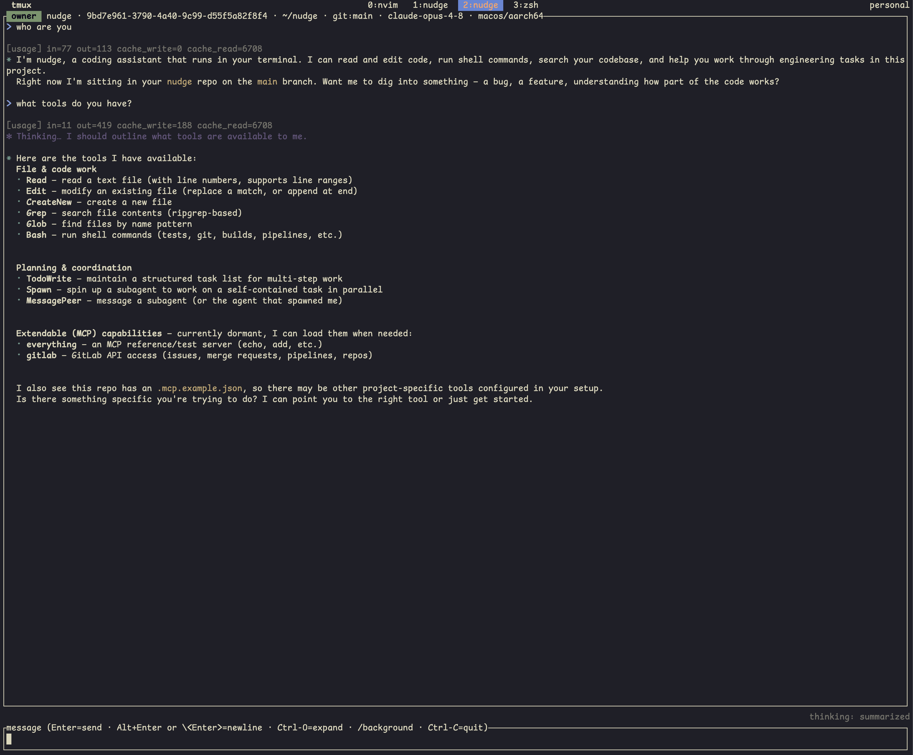

# nudge

**A coding agent you can drive from your phone — and share with your whole team.**

Scan a QR and your running session becomes a live controller in your pocket, over an
end-to-end-encrypted link that only ever sees ciphertext — approve an edit from the bus,
redirect it from the couch. Your laptop, your phone, and your teammate can all attach to the
*same* running agent at once: everyone sees the same stream, anyone can drive, an approval
clears everywhere. It's co-op mode for a coding agent — one that doesn't sleep, doesn't quit,
and follows you home.

<p align="center">
  <video src="https://github.com/user-attachments/assets/17d6523d-d66f-4ec2-b3eb-6075815539a2" controls width="800"></video>
  <br>
  <em>A live session hands off to a phone: scan the QR, approve an edit from your pocket, reattach on the laptop.</em>
</p>

Under the hood that's one simple idea: **agent communications are symmetric.** You're just a
client, your phone is just a client, and a subagent is just a client too. Every client
reaches a session through the exact same handshake and wire — so the entire multi-agent
story, and multi-attach co-op, is one tiny protocol.

Written in Rust from scratch — no agent SDK, no framework, no abstraction tax, just the raw
LLM API over HTTP. Every moving part is out in the open: the loop, the tool-use protocol,
prompt-cache economics, session persistence, permission gating. No 50-layer call stack to
trace at 2am; just readable code, easy to see when and where it decides to `rm -rf` your
weekend.

<p align="center">
  
</p>

## What makes nudge different

- **Drive a live session from your phone.** Scan a QR and your phone becomes a live
  controller over an end-to-end-encrypted relay that only ever sees ciphertext. Approve an
  edit from the bus or in the toilet. → [Remote control & relay](docs/remote-and-relay.md),
  [Mobile app](docs/mobile-app.md)
- **Real multi-client co-op.** The session lives behind a broker, not a terminal — your
  phone, your laptop, and your teammate can all attach to the same running agent at once.
  Everyone sees the same stream, anyone can drive, a permission you approve clears
  everywhere. Not screen-sharing. → [Remote control & relay](docs/remote-and-relay.md)
- **Subagents are just clients.** No special sub-agent runtime — a child agent attaches to
  its parent the exact same way your phone does, same handshake, same wire. The parent
  supervises the kid's tool calls and escalates the scary ones to you. The entire
  multi-agent story is one tiny protocol. → [Subagents](docs/subagents.md)
- **Secure by design.** The whole transport is end-to-end encrypted (host your own relay if
  you want full control). `Bash` makes the model declare its *intent* before you approve;
  there's no generic `Write` tool (only `Edit` and `CreateNew`); read-before-write is
  enforced so edits are safe. All open source. → [Security](docs/security.md)
- **Key info upfront.** Token consumption on every turn — input, output, cache read, cache
  write — plus the model, git branch, cwd, and session id in the header. Thinking is shown
  (truncated) and expandable. → [Terminal agent](docs/terminal-agent.md)

## Quick start

Requires Rust (edition 2024, via [rustup](https://rustup.rs)) and an Anthropic API key.

```bash
git clone https://github.com/nuudge/nudge.git && cd nudge
echo 'ANTHROPIC_API_KEY=sk-ant-...' > .env   # .env is gitignored
cargo run
```

Prefer a binary? `cargo install --git https://github.com/nuudge/nudge`, or grab a prebuilt
build from the [releases page](https://github.com/nuudge/nudge/releases). Full install
matrix, API-key configuration, the relay, and the Android app are in
**[Getting started](docs/getting-started.md)**.

## Components

nudge is three parts over one session protocol — three different ways for it to reach you.
The terminal agent is the whole product on its own; the rest just removes your remaining
excuses.

- **[Terminal agent](docs/terminal-agent.md)** — the core Rust binary: the agentic loop, the
  built-in tool surface, an MCP client, subagent orchestration, and a
  [ratatui](https://ratatui.rs) TUI.
- **[Remote control & relay](docs/remote-and-relay.md)** — a session can run headless behind
  a daemon and be reached from elsewhere over an end-to-end-encrypted, ciphertext-blind
  relay; pairing is a single QR scan.
- **[Mobile app (Android)](docs/mobile-app.md)** — a native Kotlin + Jetpack Compose client
  that turns your phone into a live front-end for a running session.

## Documentation

- **[Getting started](docs/getting-started.md)** — install and configure the agent.
- **[Terminal agent](docs/terminal-agent.md)** — CLI, TUI controls, slash commands, sessions.
- **[Remote control & relay](docs/remote-and-relay.md)** — detach, phone handoff, co-op,
  self-hosting a relay.
- **[Mobile app](docs/mobile-app.md)** — the Android client.
- **[Subagents](docs/subagents.md)** — spawn, supervise, converse, and the design behind them.
- **[MCP servers](docs/mcp.md)** — connect external Model Context Protocol servers.
- **[Skills](docs/skills.md)** — package reusable expertise.
- **[Security](docs/security.md)** — encryption, the permission model, safe file tools.
- **[Roadmap](docs/roadmap.md)** — what's not supported yet and what's coming.
- **[Architecture](ARCHITECTURE.md)** — the internals (developer-facing).
- **[Contributing](CONTRIBUTING.md)** — toolchain, checks, and the PR workflow.

The full docs index lives in [`docs/`](docs/README.md).

## Status

Under active development — interfaces and on-disk formats change without notice or apology.
The terminal agent, remote control, and Android app all cover their core flows; expect sharp
edges. Open an issue and it might get fixed by the very thing that caused it.

## License

[MIT](LICENSE) © 2026 Hongtao Yang
