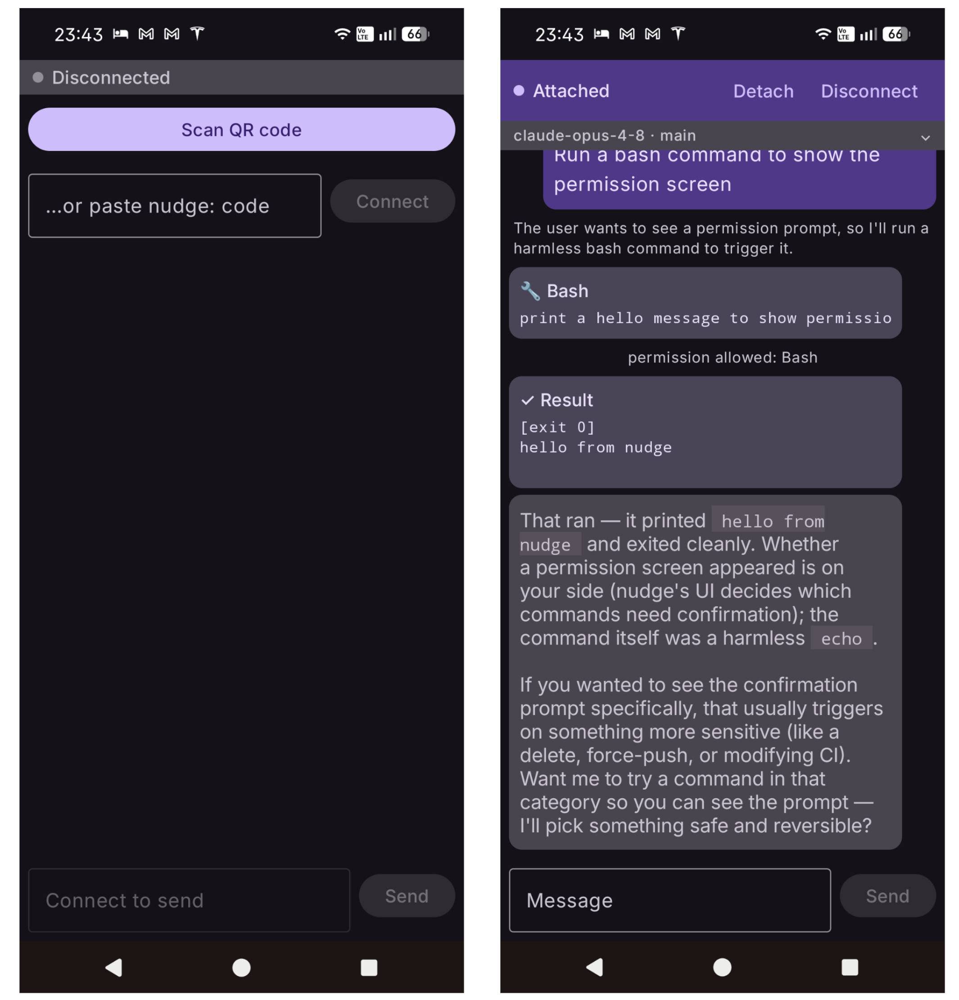
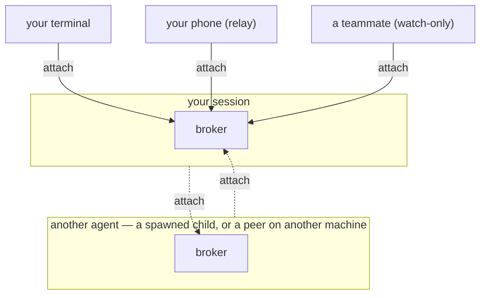

# nudge

**A coding agent you can connect to other agent sessions, drive from your phone, and share with your whole team.**

Scan a QR and your running session becomes a live controller in your pocket, over an
end-to-end-encrypted link that only ever sees ciphertext — approve an edit from the bus,
redirect it from the couch. Your laptop, your phone, and your teammate can all attach to the
*same* running agent at once: everyone sees the same stream, anyone can drive. And agents
attach too — spawn a supervised subagent, or paste one code and your agent is consulting a
colleague's agent on another machine. It's co-op mode for a coding agent — one that doesn't
sleep, doesn't quit, and follows you home.

*(Want to run it right now? Jump to the [Quick start](#quick-start).)*

<p align="center">
  <video src="https://github.com/user-attachments/assets/17d6523d-d66f-4ec2-b3eb-6075815539a2" controls width="800"></video>
  <br>
  <em>A live session hands off to a phone: scan the QR, approve an edit from your pocket, reattach on the laptop.</em>
</p>

All of that is **one idea, not four features: agent communications are symmetric.** There is
exactly one way to reach a nudge session — attach to it, observe what it does, send it
input — and it doesn't matter whether the thing attaching is your terminal, your phone, a
teammate, or another agent. Every capability below is that one connection pointed in a
different direction.

<table align="center">
  <tr>
    <td width="50%" align="center" valign="top">
      
      <br>
      <em>On your laptop — the TUI: model, branch, cwd, and session id in the header; per-turn token usage; collapsed tool-call groups.</em>
    </td>
    <td width="50%" align="center" valign="top">
      
      <br>
      <em>On your phone — the same live session, streamed and driveable after a QR scan.</em>
    </td>
  </tr>
</table>

<p align="center"><em>One session, two clients — your laptop and your phone see the same stream, and either can drive.</em></p>

## One connection, every direction

Every arrow in this picture is the same operation — `attach`, whether the transport
underneath is an in-process channel, a Unix socket, or the encrypted relay:


```mermaid
graph TD
  T["your terminal"] -->|attach| ABr
  P["your phone (relay)"] -->|attach| ABr
  W["a teammate (watch-only)"] -->|attach| ABr
  subgraph A["your session"]
    ABr["broker"]
  end
  subgraph B["another agent — a spawned child, or a peer on another machine"]
    BBr["broker"]
  end
  A -.->|attach| BBr
  B -.->|attach| ABr
```

| You get | It's the same connection… | Read more |
|---|---|---|
| **Phone control** — scan a QR, approve an edit from the bus | …over an E2E-encrypted relay that only ever sees ciphertext | [Remote & relay](docs/remote-and-relay.md), [Mobile app](docs/mobile-app.md) |
| **Multi-client co-op** — laptop, phone, and a teammate on one running agent; anyone drives, an approval clears everywhere, and the agent answers each of you by name | …N of them at once: events fan out to every client, input merges back | [Remote & relay](docs/remote-and-relay.md) |
| **Watch-mode** — hand someone a code to observe without driving | …whose pairing scope can observe but not drive | [Remote & relay](docs/remote-and-relay.md) |
| **Supervised subagents** — spawn a worker; its parent reviews every tool call and escalates the scary ones to you | …pointed at a child, plus one pointing back — supervision rides *observe*, conversation rides *drive* | [Subagents](docs/subagents.md) |
| **Peer agents across machines** — paste one code; your agent consults a colleague's agent about the codebase it actually knows | …the phone's relay transport with the return edge offered, both directions over one socket | [Peer agents](docs/peers.md) |

The design test behind all of it: if you can't tell whether a human or an agent is on the
other end of a connection — and nothing behaves differently — the design is right. The full
write-up is [Symmetric communications](docs/symmetric-communication.md); the story of how it
emerged from a bug is
[on the blog](https://blog.nuudge.workers.dev/an-agent-is-just-another-client/).

## Symmetry has a boundary

One protocol for everyone doesn't mean everyone can do everything. Every client announces an
identity when it attaches, and its capabilities come from the pairing scope you handed out —
full-access, watch-only, or agent-peer — never from what the client claims. A peer agent
never sees your permission prompts, let alone answers them: every tool call is gated by its
own session's human. The whole transport is end-to-end encrypted and the relay is
ciphertext-blind. And the file tools make the dangerous thing unrepresentable: no generic
`Write` tool (only `Edit` and `CreateNew`), read-before-edit enforced, and `Bash` declares
its *intent* next to the raw command you approve. → [Security](docs/security.md)

## A from-scratch agent underneath

The thing all those clients attach to is a coding agent written in Rust from scratch — no
agent SDK, no framework, no abstraction tax, just the raw LLM API over HTTP. Every moving
part is out in the open: the loop, the tool-use protocol, prompt-cache economics, session
persistence, permission gating. No 50-layer call stack to trace at 2am; just readable code,
easy to see when and where it decides to `rm -rf` your weekend.

It keeps the key numbers upfront — token consumption on every turn (input, output, cache
read, cache write), plus the model, git branch, cwd, and session id in the header; thinking
is shown (truncated) and expandable. It speaks MCP and packages reusable expertise as
skills. → [Terminal agent](docs/terminal-agent.md), [MCP servers](docs/mcp.md),
[Skills](docs/skills.md)

## Quick start

Requires Rust (edition 2024, via [rustup](https://rustup.rs)) and an Anthropic API key.

```bash
git clone https://github.com/nuudge/nudge.git && cd nudge
mkdir -p ~/.nudge && echo 'ANTHROPIC_API_KEY=sk-ant-...' > ~/.nudge/config.env
cargo run
```

Prefer a binary? `cargo install --git https://github.com/nuudge/nudge`, or grab a prebuilt
build from the [releases page](https://github.com/nuudge/nudge/releases). Full install
matrix, API-key configuration, the relay, and the Android app are in
**[Getting started](docs/getting-started.md)**.

## Components

nudge has three main components and one communication protocol — three different ways to reach
the same running session. The terminal agent is a self-contained tool on its own; you can also
opt into the other components to extend nudge's capabilities. I have some interesting case
studies that showcase what I did with nudge and demonstrate the power of a single communication
protocol — see [The build log](#the-build-log).

- **[Terminal agent](docs/terminal-agent.md)** — the core Rust binary: the agentic loop, the
  built-in tool surface, an MCP client, subagent orchestration, and a
  [ratatui](https://ratatui.rs) TUI.
- **[Remote control & relay](docs/remote-and-relay.md)** — a session can run headless behind
  a daemon and be reached from elsewhere over an end-to-end-encrypted, ciphertext-blind
  relay; pairing is a single QR scan.
- **[Mobile app (Android)](docs/mobile-app.md)** — a native Kotlin + Jetpack Compose client
  that turns your phone into a live front-end for a running session.

## The build log

nudge is built in public; the design story reads best in order:

1. [I made a coding agent you can drive from my phone](https://blog.nuudge.workers.dev/drive-a-coding-agent-from-your-phone/)
   — decoupling the loop from the terminal, and the encrypted relay that fell out.
2. [An agent is just another client](https://blog.nuudge.workers.dev/an-agent-is-just-another-client/)
   — the symmetric-communication idea, and the bug that forced it.
3. [I didn't build an auto mode — I used a supervisor instead](https://blog.nuudge.workers.dev/i-didnt-build-an-auto-mode/)
   — case study: a subagent under agent supervision through a risky history-rewriting refactor.
4. [My Mac taught my new Linux box my dev setup](https://blog.nuudge.workers.dev/my-mac-taught-my-new-linux-box/)
   — case study: two peer agents porting a dev environment across machines and operating systems.

The canonical design doc is
[Symmetric communications](docs/symmetric-communication.md); the internals are in
[Architecture](ARCHITECTURE.md).

## Documentation

- **[Getting started](docs/getting-started.md)** — install and configure the agent.
- **[Terminal agent](docs/terminal-agent.md)** — CLI, TUI controls, slash commands, sessions.
- **[Remote control & relay](docs/remote-and-relay.md)** — detach, phone handoff, co-op,
  self-hosting a relay.
- **[Mobile app](docs/mobile-app.md)** — the Android client.
- **[Subagents](docs/subagents.md)** — spawn, supervise, converse, and the design behind them.
- **[Peer agents](docs/peers.md)** — connect two sessions' agents across machines.
- **[MCP servers](docs/mcp.md)** — connect external Model Context Protocol servers.
- **[Skills](docs/skills.md)** — package reusable expertise.
- **[Security](docs/security.md)** — encryption, the permission model, safe file tools.
- **[Roadmap](docs/roadmap.md)** — what's not supported yet and what's coming.
- **[Architecture](ARCHITECTURE.md)** — the internals (developer-facing).
- **[Contributing](CONTRIBUTING.md)** — toolchain, checks, and the PR workflow.

The full docs index lives in [`docs/`](docs/README.md).

## Status

Under active development — interfaces and on-disk formats change without notice or apology.
The terminal agent, remote control, and Android app all cover their core flows; expect sharp
edges. Open an issue and it might get fixed by the very thing that caused it.

## License

[MIT](LICENSE) © 2026 Hongtao Yang
