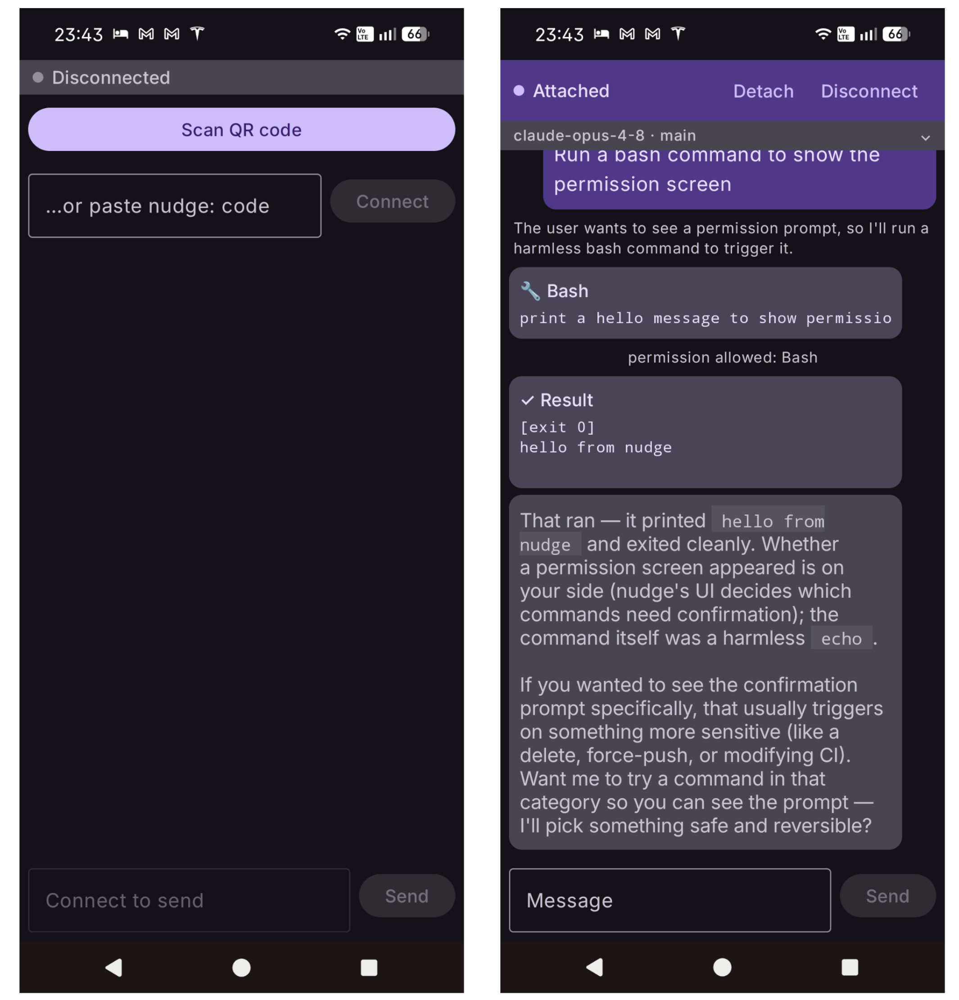

# Mobile app (Android)

Work anywhere. Any time. Never stop. Scan the QR code the agent prints and your phone
becomes a live controller for the running session — the office is now wherever you are, and
it never closes. It's a native Kotlin + Jetpack Compose client that turns your phone into a
live front-end for a session running on your machine.

<p align="center">
  
  <br>
  <em>The Android app before and after pairing: waiting to attach, then streaming the same live session as the terminal.</em>
</p>

## What it does

- **Pair in one scan** — point the camera at the agent's QR code (or paste it). No accounts,
  no setup, no escape.
- **Watch it work, live** — streamed replies and thinking, every tool call and its result,
  in markdown; a glance line shows the model and git branch. Approve a refactor from the
  bus, review a stack trace at dinner, touch grass while it touches your codebase.
- **Approve from anywhere** — when the agent wants to run a command or edit a file, the
  prompt finds you wherever you are; **allow or deny remotely**, the same gate as the
  terminal. It will wait. It is infinitely patient.
- **Send and steer** — redirect it mid-task from your pocket.
- **Come and go** — detach and reattach to the same session; the transcript replays on
  reconnect, and the agent keeps grinding while you're "away."
- **Private by design** — end-to-end encrypted through a ciphertext-blind relay that only
  ever sees ciphertext. The rendezvous id is a 128-bit secret carried inside the QR code, so
  an unpaired device can neither find nor decrypt your session — and neither can the relay.
  See [Security](security.md).

The app speaks a small framed protocol shared — as a pure-JVM kit (`android/protocol/`) —
with the agent and the relay, so the wire format has a single source of truth. This is the
same handshake and event protocol the terminal speaks; byte-for-byte serialization tests
pin the two together.

## Requirements

Minimum device API is 26 (Android 8.0). Phone handoff needs a relay configured on the host
(`NUDGE_RELAY`) — see [Remote control & relay](remote-and-relay.md).

## Install

### Prebuilt APK

The maintainer publishes a signed release APK to the project's GitHub Releases, so you can
skip the Android toolchain entirely. This is purely a matter of trust: the APK is signed
with the release key, and installing it means trusting that key and that it was built
honestly.

```bash
# browse available versions at https://github.com/nuudge/nudge/releases
curl -fL -o nudge.apk \
  "https://github.com/nuudge/nudge/releases/latest/download/nudge.apk"
adb install nudge.apk    # or copy nudge.apk to your phone and tap it (enable "install unknown apps")
```

### Build from source

Requires the **Android SDK** and a **JDK** (the build targets JDK 21). The easiest path is
to open the `android/` directory in **Android Studio**, which provisions the SDK and runs
the app on a device or emulator for you.

From the command line, point Gradle at your SDK and assemble a debug APK:

```bash
cd android
echo "sdk.dir=$ANDROID_HOME" > local.properties   # or export ANDROID_HOME / ANDROID_SDK_ROOT
./gradlew :app:assembleDebug                       # first run downloads Gradle + deps
```

The APK lands at `android/app/build/outputs/apk/debug/app-debug.apk`; install it on a
connected device with:

```bash
adb install android/app/build/outputs/apk/debug/app-debug.apk
```

## Pairing

Launch the app and scan the QR the agent shows on `/background` (or `nudge --daemon`) to
drive the live session. QR scanning uses Google Play Services; on a device without it, paste
the pairing code into the app's text field instead.
