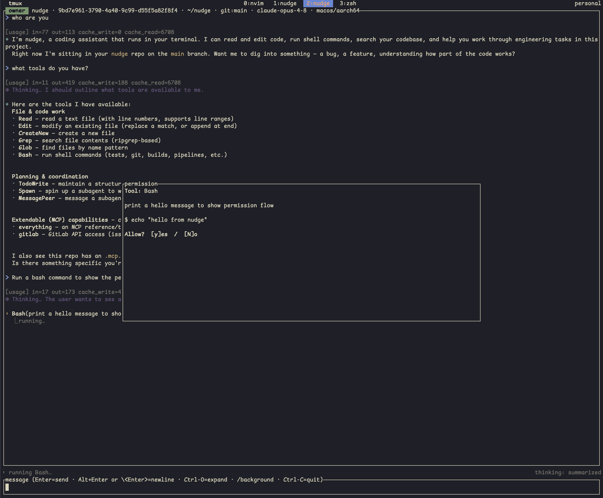

# Security

nudge is secure by design: the transport is end-to-end encrypted, the tool surface makes
the model declare its intent before it acts, and edits are guarded so the agent can't
silently destroy your files. Everything is open source, and you can host every component
yourself.

## End-to-end encryption

Every frame is end-to-end encrypted (dryoc) before it leaves your device. Phone handoff and
cross-machine attach route through a **relay** — a publicly reachable box both devices dial
out to — but the relay is **ciphertext-blind**: it only ever forwards opaque bytes and could
not read your session if it tried. It keeps no transcript.

The pairing code carries the relay URL, a one-time 128-bit rendezvous id, and the E2E key,
all inside the QR. An unpaired device can neither find nor decrypt your session, and neither
can the relay. Treat the pairing code as a secret — anyone you hand it to can join.

If you don't want to trust anyone else's box, [run your own relay](../deploy/README.md). It
binds loopback only, keeps no state, and sits outside the encryption boundary — so even the
machine you own never sees your plaintext.

## The permission model

Shell-executing and file-mutating tools prompt before running; read-only tools
(`Read`/`Grep`/`Glob`/`TodoWrite`) auto-allow.

  
   
  <em>A permission prompt: the model's stated intent as the label, the raw command it will run, and your allow/deny.</em>

- **`Bash` declares its intent.** Before running a command the model must state an *intent*
  ("count lines in all Rust files"), shown as the action label — while the permission prompt
  always shows the raw command. You approve what runs, not the label.
- **Permission prompts await a typed reply.** The agent literally `.await`s your decision. A
  denial cancels the rest of the tool batch and pauses for your next instruction, which
  rides back in the same turn — denial means "I want something different", not "retry".
- **Under multi-attach**, a permission prompt goes to every attached client and the first
  answer wins, so an approval clears everywhere.
- **Subagent escalation.** A parent supervising a subagent can approve routine calls itself,
  but anything destructive, irreversible, or off-task is escalated to *your* prompt. A
  subagent can never approve its own way around a human. See [Subagents](subagents.md).

## Safe-by-construction file tools

There is deliberately **no generic `Write` tool**. Tools partition by file-state
precondition:

- **`Edit`** requires an existing file.
- **`CreateNew`** requires a non-existing path.

There is no create-or-overwrite primitive, because wholesale-overwriting a file the model
hasn't read would let it silently destroy content.

**Read-before-write is enforced.** The agent tracks which files it has read and refuses to
`Edit` a file it hasn't seen (or that changed since), so an edit is always made against known
content.

## Reporting vulnerabilities

nudge handles end-to-end-encrypted sessions, so please report security issues **privately**
to the maintainer rather than in a public issue, to allow a fix before disclosure. See
[CONTRIBUTING.md](../CONTRIBUTING.md#reporting-bugs-and-security-issues).
