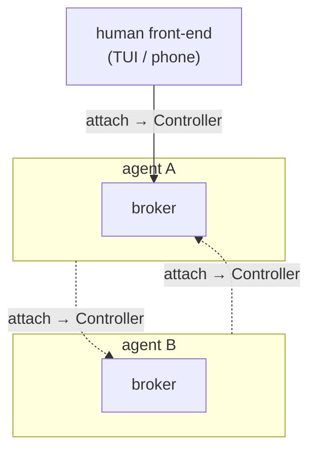

# An agent is just another client

The design philosophy behind nudge's remote control, multi-client co-op, and subagents.
Where the [Subagents](subagents.md) doc covers *what the feature does* and
[Architecture](../ARCHITECTURE.md) covers *how the code is laid out*, this doc explains the
single idea all of it falls out of — and why the same small protocol that lets you drive an
agent from your phone is also the entire multi-agent story.

## The thesis

There should be exactly **one** way to talk to an agent, and it should not matter whether a
human or another agent is on the other end.

A human at a terminal, a phone over the relay, and another agent driving a sub-task all
reach an agent through the *same* mechanism, over the *same* transports, with the *same*
protocol. Get that right and subagents, multi-client collaboration, remote control, and
watch-mode stop being four features and become one.

## Five principles

Everything below is downstream of these, in priority order.

1. **An agent is just another client.** Whatever is on the other end of a connection —
   human, phone, or peer agent — is indistinguishable to the agent loop. It emits the same
   events and accepts input over the same channel. Roles like *parent/child*,
   *supervisor/worker*, or *human/agent* are **emergent** from the direction of a connection
   and the system prompt an agent runs under — never encoded in a type or a branch. There is
   no `if peer { … } else { … }`.
2. **One mechanism, every transport.** Reaching an agent is always `attach → Controller`,
   whether the transport is an in-process channel, a Unix socket, or an encrypted relay
   websocket. Local vs. remote is a transport substitution, not a separate code path.
3. **Compose primitives; don't add channels.** Every capability — watching, driving,
   supervising, discussing, spawning, remote control — is a composition of two primitive
   half-channels (**observe** and **drive**) over uniform connections. When a new capability
   comes up, the question is "which composition of the existing primitives is this?" — not
   "what new channel do we add?"
4. **Bidirectional by construction, not by feature.** A single connection is a one-way
   relationship: A drives and observes B. Two-way collaboration is *two connections*, not a
   special "duplex" mode. Symmetry between two agents means each is a client of the other —
   nothing more.
5. **The symmetry test.** If you cannot tell whether a human or an agent is on the other end
   of a connection, and it does not change how you behave, the design is right.

## One mechanism: `attach → Controller`

A `SessionHost` owns the agent loop and a **broker**; the loop's channels terminate at the
broker, not at any front-end, so clients attach and detach without ending the session.
Reaching a session goes through one trait:

```rust
trait SessionHandle {
    async fn attach(&self) -> Option<Controller>;
}
```

implemented by the in-process broker handle, the Unix-socket client, and the relay
websocket client. Every one returns the same `Controller`:

```rust
struct Controller {
    events: Receiver<ControllerEvent>,  // what the agent emits  (observe)
    ui_tx:  Sender<UiEvent>,            // what you send it       (drive)
}
```

The TUI is generic over `SessionHandle` and literally cannot tell which transport it got —
local versus remote is a transport swap, not a code path. The `ControllerEvent` / `UiEvent`
pair *is* the serializable wire protocol that crosses the socket and the relay, so the
Rust terminal and the Kotlin phone app speak the exact same events (pinned by byte-for-byte
serialization tests).

## Every relationship is an attach

Each agent is simultaneously a **server** (a broker others attach to) and a **client** (it
attaches to peers). A relationship is a directed edge, and an edge *is* one `attach`. All
three connections below are the identical operation:



- `H → A`: a human drives A.
- `A → B`: A drives and observes B — A is a client of B.
- `B → A`: B drives and observes A — B is a client of A.

Two agents collaborating as equals is just both dotted edges existing at once. There is no
"duplex peer" object — only two ordinary client attachments pointing opposite ways. Spawning
a child *is* this: create an agent, then mutually attach.

## Two half-channels: supervision vs. conversation

Every `Controller` carries the same two half-channels, and they cleanly separate the two
things one agent does with another:

| Half-channel | Direction | Carries | Purpose |
| --- | --- | --- | --- |
| **observe** (`ControllerEvent`) | peer → me | `AssistantText`, `ToolUseStart`, `ToolResult`, `PermissionRequest` | **supervision** — watch the peer work; answer its permission check-ins |
| **drive** (`UiEvent`) | me → peer | `UserMessage`, `PermissionResponse` | **conversation & control** — send instructions/replies; return verdicts |

This split is why discussion "just works." When B wants to *address* A, it sends a
`UserMessage` up A's drive channel — the exact path a human's message takes. That already
folds into the agent's context **and** triggers a turn, so no special "fold the peer's words
into my transcript and wake me up" machinery is needed; it's the human input path, reused
unchanged. Supervision stays on the observe channel and never entangles with it.

## The handshake

Attach is a symmetric identity exchange, applied to **every** client — human or agent — so
the two remain the same protocol, not two that merely look alike. Each client announces
itself as it attaches:

```rust
Attach { after_seq, who: ClientIdentity { kind, name, session_id, task } }
```

`kind` is `Human` or `Agent`. A spawned agent carries its `session_id` and the `task` it was
assigned; a human just carries a name. The broker records it and stamps every turn with who
sent it, which is what turns an opaque "peer 0" into a named collaborator and lets a shared
session attribute every message to its sender. Because it's the *same* frame for both, the
human path and the agent path stay one protocol.

## What this unifies

Because a peer is only a client, capabilities that would otherwise each be a bespoke
subsystem collapse into compositions of the primitives above:

- **Remote control** — a human driving a headless session from a phone or another machine is
  `attach` over the relay transport instead of the in-process one.
- **Multi-client co-op** — several clients on one session is just the broker fanning events
  to N controllers and merging their input. A permission prompt goes to everyone attached and
  the first answer wins, so an approval clears everywhere.
- **Watch-mode** — a human observing while a peer drives is not a mode; it's a second attach.
- **Subagents** — spawn is *create an agent + mutually attach*. Supervision rides the observe
  channel; conversation rides the drive channel; roles follow from who spawned whom.
- **Cross-machine multi-agent** — an agent driving another agent across the network is the
  same operation with the relay transport, exactly the encrypted path your phone already
  uses. The transport is built; wiring agents to dial each other over it is the next edge on
  the [roadmap](roadmap.md).

## Why it matters

Most agent stacks treat sub-agents as a bespoke construct: a spawn API, a privileged parent,
a side-band message bus. Then remote control is another bespoke construct, human-in-the-loop
another, multi-agent another — every mode its own subsystem.

nudge takes the opposite bet: define *one* way to talk to an agent, make humans and agents
equal citizens of it, and let every richer behavior emerge as a composition of the same two
primitives over the same uniform connections. If the symmetry test holds — you genuinely
cannot tell, and need not care, whether a human or an agent is on the other end — then the
same small protocol that drives an agent from your phone also drives an agent from another
agent across the world, and the second subsystem never gets written.

---

*The story of how this design emerged from a bug is in the blog post
[An agent is just another client](../blog_posts/an-agent-is-just-another-client.refined.md).
For the runtime that implements it, see [Architecture](../ARCHITECTURE.md); for the
subagent feature it powers, see [Subagents](subagents.md).*
