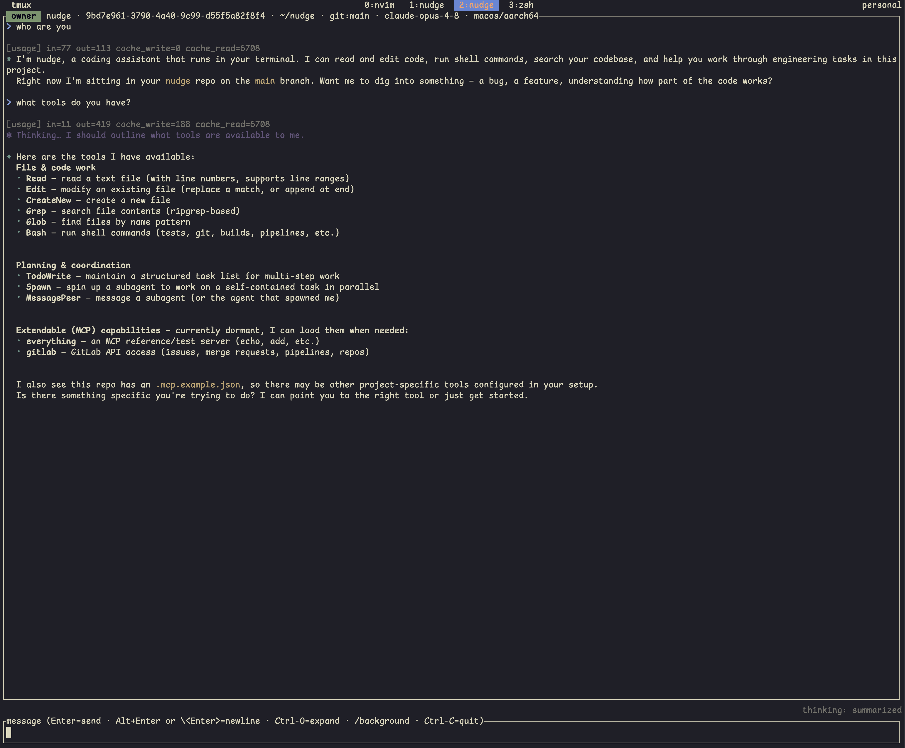

# Terminal agent

The core Rust binary: the agentic loop, the built-in tool surface, an MCP client,
subagent orchestration, and a [ratatui](https://ratatui.rs) TUI. It's the whole product
on its own — everything else (relay, phone, subagents) just removes your remaining
excuses.

<p align="center">
  
  <br>
  <em>Key info upfront: the header, per-turn token usage, and collapsed tool-call groups.</em>
</p>

## The agentic loop

The model plans, calls tools, observes results, and iterates until the task is done,
bounded by an iteration budget that ends gracefully (the agent explains it hit the cap and
asks how to proceed).

## Tool surface

`Bash`, `Read`, `Edit` (modify + append modes), `CreateNew`, `Grep` (structured ripgrep),
`Glob`, `TodoWrite`. Tool names and field shapes are wire-compatible with Claude Code where
they overlap, so your muscle memory transfers — only the bill changes.

Shell-executing and file-mutating tools prompt before running; read-only tools auto-allow.
See [Security](security.md) for the full permission model and the `Edit`/`CreateNew`
design.

## What shows on screen

The TUI keeps key information upfront so you always know what the agent is doing and what
it's costing you.

- **Header** — session id, cwd, git branch, model, and platform, all in the title bar.
- **Per-turn token consumption** — input, output, cache read, and cache write shown on
  every turn, so you know what you're spending.
- **Collapsed-by-default actions** — each tool call is one compact group with a live
  status bullet (spinner → ok/error) and a one-line result row.
- **Thinking** — the model's reasoning is shown (truncated) and expandable; `--thinking
  omitted` hides it entirely for faster first tokens at the same cost.

`Ctrl-O` expands or collapses tool results and thinking.

## CLI

```
nudge [OPTIONS]

OPTIONS:
    --resume <id>        Resume a previous session from ~/.nudge/projects/<cwd>/<id>.jsonl
                         (the id is shown in the TUI title bar)
    --list               List this project's saved sessions (name, id, branch,
                         transcript size, last used), most-recent-first, then exit
    --thinking <mode>    Thinking display: summarized (default) or omitted
    --daemon             Run the session headless (no TUI); hosts over $NUDGE_RELAY,
                         or a local Unix socket with --socket
    --connect            Attach a TUI to a running --daemon (with --pair-code, or
                         --socket for a local one)
    --pair-code <code>   (--connect) Attach using a pairing code from the host's QR
    --socket <path>      Host/attach over a local Unix socket instead of the relay
                         (for debugging the transport without a relay)
    -h, --help           Show help
```

The `--daemon` / `--connect` / `--pair-code` flags are about detaching and remote control
— see [Remote control & relay](remote-and-relay.md).

## TUI controls

Message input (readline-style editing):

| Key | Action |
|---|---|
| `Enter` | send message |
| `Alt+Enter` / `Ctrl+Enter` / `Ctrl-J` / trailing `\` + `Enter` | insert newline (paste keeps newlines) |
| `←` `→` | move cursor one character |
| `↑` `↓` | move cursor one display row (follows wrapped lines; the input box scrolls to keep the cursor visible) |
| `Ctrl-A` / `Ctrl-E` | jump to start / end of line |
| `Ctrl-U` | delete from cursor to start of line |
| `Ctrl-K` | delete from cursor to end of line |
| `Ctrl-W` | delete the previous word |

Everything else:

| Key | Action |
|---|---|
| `Ctrl-O` | expand / collapse tool results and thinking |
| mouse wheel / `PgUp` `PgDn` / `Home` `End` | scroll the log / jump / resume tail-follow |
| `y` / `n` / `Esc` | answer permission prompt (`↑` `↓` `PgUp` `PgDn` scroll its detail popup) |
| `↑` `↓` then `Enter` / `Esc` | choose / cancel in the model picker (`/model`) |
| `Enter` (while backgrounded) | return to the foreground |
| `Ctrl-C` (or `Ctrl-D` on empty input) | quit |

> **tmux users**: plugins that bind `C-h/j/k/l` for pane navigation (e.g.
> vim-tmux-navigator) intercept `Ctrl-J`/`Ctrl-K` before nudge sees them. Add `nudge` to
> the plugin's pass-through pattern, e.g.
> `set -g @vim_navigator_pattern '(\S+/)?g?\.?(view|l?n?vim?x?|fzf|nudge)(diff)?(-wrapped)?'`.

## Slash commands

Type these as a single-line message starting with `/` (multi-line input that happens to
start with `/`, e.g. a pasted path, still goes to the model):

| Command | Action |
|---|---|
| `/model` | open the model picker |
| `/mcp` | list loaded MCP servers and the dormant ones available to load |
| `/mcp load <name>` / `/mcp unload <name>` | connect / disconnect a dormant server mid-session |
| `/session-rename [name]` | rename the session; bare, the agent derives a name (git branch + short id in a repo, else an LLM-suggested summary) |
| `/background` (alias `/bg`) | detach and run the agent headless; with `NUDGE_RELAY` set, also shows a pairing QR — reattach with `Enter` |

## Sessions

Every conversation is appended to a JSONL log under
`~/.nudge/projects/<flattened-cwd>/<uuid>.jsonl`. `--resume <id>` restores it, with strict
truncation of any incomplete trailing turn. `--list` shows this project's saved sessions,
most-recent-first.

On API failure mid-turn the in-memory conversation rolls back to the last completed turn,
so it always stays on a valid alternating-role boundary; the JSONL log is independent and
append-only — it's the audit trail, not the API payload.

## Prompt caching

Layered `cache_control` breakpoints on the system prompt plus a floating breakpoint that
walks forward along the chat history. At ~100-message depth this cuts billed input ~7× and
shortens time-to-first-token accordingly.
